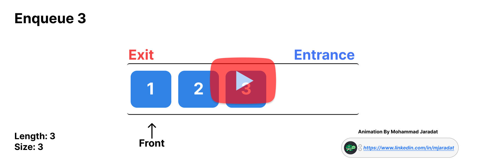

# **Behind the Scenes of Implementing an Array-Based Queue in JavaScript \- By Mohammad Jaradat.**

Why bother and write about this? isn’t it as simple as the logic below? Bear with me as I will explain how and why that’s not the most proper way to do it.

```javascript
Enqueue → array.push(x) // Add Last
Dequeue → array.shift() // Remove First
```

## **Motivation**

Regardless of the programming language or the data structure used to implement a queue, the two native operations of a queue, enqueue and dequeue, shall have a time complexity (T.C.) of ***O(1)***.  
Imagine you're at a checkout line, and just as you're about to pay, every single person behind you in line has to take a step forward before you can proceed. That's exactly what happens when you use  shift , which has a T.C. of ***O(n)***.

## **Approach**

A better performance can be achieved by using a tracker  `size`  to keep count of the number of valid elements in the queue. This value can also be used to find the position of the current head to achieve a constant time dequeue, via  `head index = array.length - size` . Note that  size  is different from the array length, which includes both enqueued and dequeued elements.

## **Demonstration**

You can watch my demo below or [click here](https://drive.google.com/file/d/1\_DLz8Fac-BZMYvbK53\_X8wloBre1P21k/view?usp=sharing).

[](https://drive.google.com/file/d/1\_DLz8Fac-BZMYvbK53\_X8wloBre1P21k/view?usp=sharing)

## **JavaScript Sample**
```javascript
class Queue{
    constructor(){
        this.array = [];
        this.size = 0;
    }

    enqueue(x){
        this.array.push(x);
        this.size++;
    }
    dequeue(){
        if(!this.isEmpty()){
            const index = this.array.length - this.size;
            const head = this.array[index];
            this.array[index] = null; // just to indicate that this value was "dequeued".

            this.size--;
            if(this.size === 0){ // when all valid elements are dequeued, empty the array from these "dequeued" elements.
                this.array = [];
                this.size = 0;
            }
            return head;
        }
        throw new Error("Empty Queue, can't dequeue");
    }
   // The methods below are not native methods of queue, and are only complementary.
    peek(){
        if(!this.isEmpty())
            return this.array[this.array.length - this.size];
        throw new Error("Empty Queue, can't peek");

    }
    isEmpty(){
        return this.size <= 0;
    }
    getSize(){ // "dequeued" elements are excluded.
        return this.size;
    }
}

```
With this implementation, the dequeue operation is achieved in ***O(1)***  instead of ***O(n)***. I think of this approach as a more fitting implementation rather than an improvement in T.C., unless, of course, the context requires a behavior similar to dequeueing using  shift  operation.

## **Ending Note**

Some might consider this a drawback in terms of space complexity (S.C.), as the dequeued elements aren't actually removed but only hidden and not accessible by users until they're discarded along with the array when the latter has been emptied.  
Here comes the question: "What if the queue was never emptied?"

1. Similar to stacks, queues are meant to be emptied at some point, since both are **mainly** used to preserve the order of how the data was inserted, and how it’s going to be handled, not to store it for long-term usage like a List or Array.  
2. There is actually another approach using fixed-sized arrays with front and rear pointers to implement a queue that makes use of the dequeued spots. This is an improvement to both T.C. and S.C. of queue operations, but of course, has its own limitations too, as the array size is fixed and when it's full, resizing it to accommodate new elements can either slow down enqueue operations or require excessive pre-allocation of space. Which brings us back to square one. Check the following tool to visualize this implementation: [Virtual Labs](https://ds1-iiith.vlabs.ac.in/exp/stacks-queues/queues/queuesarrays.html).  
3. As always, there is a trade-off between performance and memory usage. The choice depends entirely on the specific case and constraints of the real-life application.

###  If you found this article insightful, feel free to connect with me on [LinkedIn](https://www.linkedin.com/in/mjaradat).
